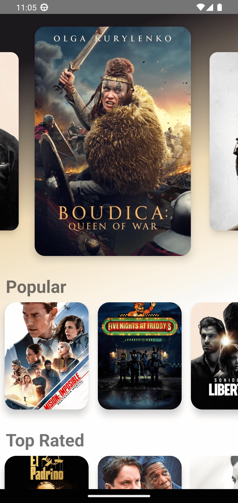
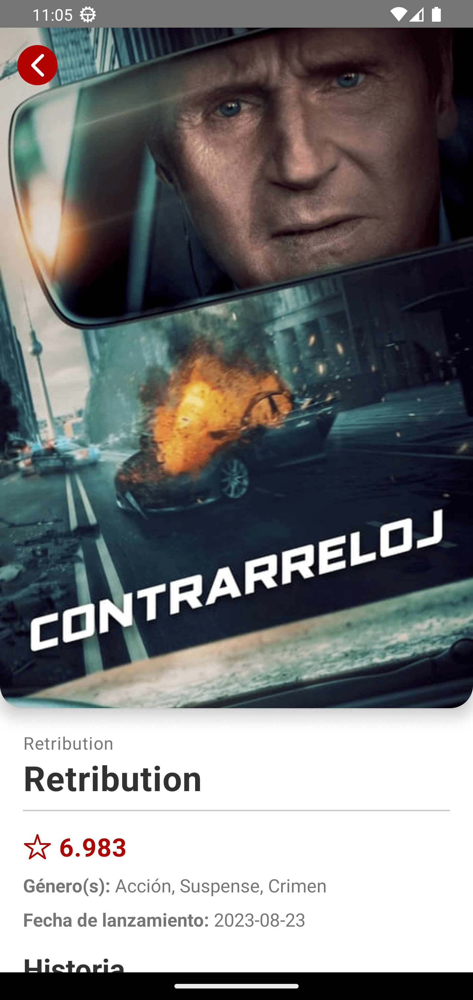

# React Native & TypeScript - Movie App

---

# Temas puntuales de la sección

### ¿Qué veremos en esta sección?

- El objetivo es crear una aplicación que consuma un API de películas que sacaremos de [TMDB](https://developer.themoviedb.org/reference/intro/getting-started) y que sea visualmente atractiva, también hacer la re-utilización de componentes y tener dos vistas, una que será el Home de la aplicación y otra vista donde estará el detalle de la película como descripción general, actores, etc.
- Se trabajará con gradientes para hacer el efecto visual de cambio cuando una nueva película es seleccionada.

  - **NOTA:** Actualmente tiene las configuraciones para Android, faltaría realizar las configuraciones para iOS.

  - Puntualmente se usará:

    - Stack Navigator para los screens
    - Custom Hooks
    - Axios
      - Promesas simultáneas
      - Loadings de peticiones y componente Loader
    - Carousels o sliders de imágenes
      - Librería: react-native-reanimated-carousel
      - Flat List (componente de React Native)
    - Scroll View y Scroll View anidado
    - ContextAPI
    - Global State
    - Extraer colores de las imágenes
    - Función helper

### \* RECURSOS A USAR:

- Axios (https://www.npmjs.com/package/axios):
  - `npm i axios`
- react-native-reanimated-carousel (https://github.com/dohooo/react-native-reanimated-carousel) (https://www.npmjs.com/package/react-native-reanimated-carousel):
  - `npm i react-native-reanimated-carousel`
  - `npm i react-native-gesture-handler react-native-reanimated`
- react-native-linear-gradient (https://github.com/react-native-linear-gradient/react-native-linear-gradient):
  - `npm i react-native-linear-gradient`
- react-native-image-colors (https://github.com/osamaqarem/react-native-image-colors)
  - `npm i react-native-image-colors`

### \* IMÁGENES DE LA MOVIE APP:

<style>
  .image-container {
    text-align: center;
  }
  .image-container img {
    margin: 15px;
  }
</style>

<div class="image-container">
  
  
  
  
  
  
</div>

---

This is a new [**React Native**](https://reactnative.dev) project, bootstrapped using [`@react-native-community/cli`](https://github.com/react-native-community/cli).

# Getting Started

> **Note**: Make sure you have completed the [React Native - Environment Setup](https://reactnative.dev/docs/environment-setup) instructions till "Creating a new application" step, before proceeding.

## Step 1: Start the Metro Server

First, you will need to start **Metro**, the JavaScript _bundler_ that ships _with_ React Native.

To start Metro, run the following command from the _root_ of your React Native project:

```bash
# using npm
npm start

# OR using Yarn
yarn start
```

## Step 2: Start your Application

Let Metro Bundler run in its _own_ terminal. Open a _new_ terminal from the _root_ of your React Native project. Run the following command to start your _Android_ or _iOS_ app:

### For Android

```bash
# using npm
npm run android

# OR using Yarn
yarn android
```

### For iOS

```bash
# using npm
npm run ios

# OR using Yarn
yarn ios
```

If everything is set up _correctly_, you should see your new app running in your _Android Emulator_ or _iOS Simulator_ shortly provided you have set up your emulator/simulator correctly.

This is one way to run your app — you can also run it directly from within Android Studio and Xcode respectively.

## Step 3: Modifying your App

Now that you have successfully run the app, let's modify it.

1. Open `App.tsx` in your text editor of choice and edit some lines.
2. For **Android**: Press the <kbd>R</kbd> key twice or select **"Reload"** from the **Developer Menu** (<kbd>Ctrl</kbd> + <kbd>M</kbd> (on Window and Linux) or <kbd>Cmd ⌘</kbd> + <kbd>M</kbd> (on macOS)) to see your changes!

   For **iOS**: Hit <kbd>Cmd ⌘</kbd> + <kbd>R</kbd> in your iOS Simulator to reload the app and see your changes!

## Congratulations! :tada:

You've successfully run and modified your React Native App. :partying_face:

### Now what?

- If you want to add this new React Native code to an existing application, check out the [Integration guide](https://reactnative.dev/docs/integration-with-existing-apps).
- If you're curious to learn more about React Native, check out the [Introduction to React Native](https://reactnative.dev/docs/getting-started).

# Troubleshooting

If you can't get this to work, see the [Troubleshooting](https://reactnative.dev/docs/troubleshooting) page.

# Learn More

To learn more about React Native, take a look at the following resources:

- [React Native Website](https://reactnative.dev) - learn more about React Native.
- [Getting Started](https://reactnative.dev/docs/environment-setup) - an **overview** of React Native and how setup your environment.
- [Learn the Basics](https://reactnative.dev/docs/getting-started) - a **guided tour** of the React Native **basics**.
- [Blog](https://reactnative.dev/blog) - read the latest official React Native **Blog** posts.
- [`@facebook/react-native`](https://github.com/facebook/react-native) - the Open Source; GitHub **repository** for React Native.
